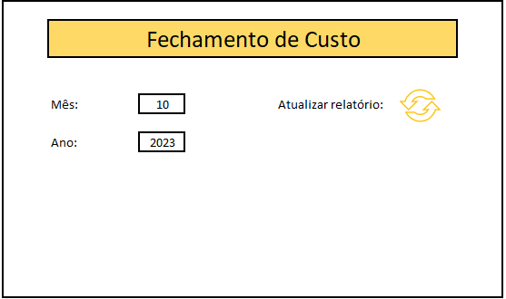

# Automatização de Indicadores

Bem-vindo ao repositório de automatização de indicadores! Este projeto visa automatizar a extração de dados do SAP e utilizar Macros no VBA para simplificar e otimizar o processo.

## Funcionalidades

- **Extração de Dados:** Utilizamos scripts para extrair dados diretamente do SAP, tornando o processo mais eficiente e menos suscetível a erros manuais.

- **Macros no VBA:** As Macros no VBA são usadas para automatizar tarefas específicas, proporcionando uma automação mais avançada e personalizada.

## Como Contribuir

Sinta-se à vontade para contribuir para o desenvolvimento deste projeto. Se você tiver ideias, melhorias ou encontrar problemas, por favor, abra uma issue ou envie um pull request.

## Menu para Atualização

Aqui está uma captura de tela do menu indicador para dar uma ideia visual do projeto:

## Como executar?
- **Baixe as pastas Automatizacao e custo**
- **Dentro da pasta Automatizacao,abra o arquivo Menu_Automatizacao**
- **Escolha o mês e o ano**
- **Clique no icone de setas ao lado  de Atualizar Relatório.**
- **Faça login no SAP e aguarde.** 
---
